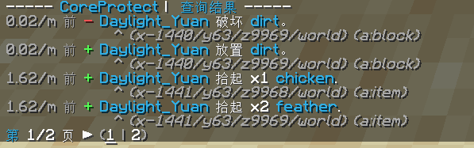

## CoreProtect
CoreProtect是一款可以查询方块状态/容器状态的插件,可以使用指令`/co i`来进入/退出查询状态.

## inspect
  
当你左键任意方块的时候，插件可以查询该方块被哪位玩家所放置  
当你右键箱子、木桶等容器方块的时候，插件会为显示该容器方块的物品变更记录  
再次输入`/co i`退出查询状态
## lookup
如果你想查询某位玩家在50分钟内都做了些什么，可以输入`/co lookup u:Daylight_Yuan t:50m`  
  
这里会显示该玩家50分钟内的所有操作.  
如果你要查询指定操作，请加参数  

| 参数 | 介绍 |
| :---: | :---: |
| `u:<user>`  | 指定要查询的玩家 |
| `t:<time>`  | 指定要查询的时间 |
| `r:<radius>`| 指定搜索范围的半径 |
| `a:<action>`| 将查询限制为特定操作 |
| `i:<include>`| 在查询中包含特定的区块/实体 |
| `e:<exclude>`| 从查询中排除区块/实体|  

如果你想查询该玩家50分钟内都从容器方块中拿了些什么或者放了些什么，  
输入指令`/co lookup u:Daylight_Yuan t:50m a:container` 
## a:action部分可以使用的参数  
  
| Action | 介绍 |
| --- | --- |
| `a:block` | 方块放置/破坏 |
| `a:+block` | 放置方块 |
| `a:-block` | 破坏方块 |
| `a:chat` | 聊天中发送的信息 |
| `a:click` | 玩家互动 |
| `a:command` | 使用的指令 |
| `a:container` | 从箱子中取出或放入物品 |
| `a:+container` | 放入箱子的物品 |
| `a:-container` | 取出箱子的物品 |
| `a:inventory` | 放入或取出玩家背包中的物品 |
| `a:+inventory` | 放入玩家背包的物品 |
| `a:-inventory` | 取出玩家背包的物品 |
| `a:item` | 玩家掉落、投掷、拾取、存放或收回的物品 |
| `a:+item` | 玩家拾取或收回的物品 |
| `a:-item` | 玩家掉落、投掷或存放的物品 |
| `a:kill` | 被杀死的怪物/动物|
| `a:session` | 玩家登录或登出 |
| `a:+session` | 玩家登录 |
| `a:-session` | 玩家登出 |
| `a:sign` | 在牌子上所写的信息 |
| `a:username` | 玩家用户名改变 |  

## near
输入指令`/co near`可以查询5格内所有的操作变化  
  
如果出现 `#chicken 击杀 #chicken` 等类似情况,是生物被挤压而死  

