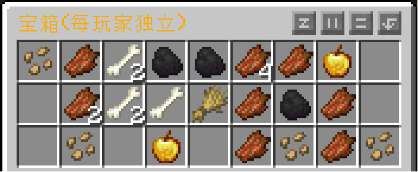

## 独立宝箱
---
   

每个玩家都会有 **独立的宝箱** (例如村庄的箱子/地牢的箱子/海底神殿的箱子/末地鞘翅展示框等等)   
如果你想要破坏宝箱, 请尝试 `Shift潜行+长按左键`  
如果你想要破坏末地鞘翅展示框, 请`主手使用木棍`长按进行破坏

## 宠物所属
---
通过`Shift+右键`来查询该宠物的主人  
(通过插件捕捉的宠物无法使用该设定查询所属主人)

## 低耐久提示
---
当您的装备或者工具`低于15%的耐久`时，服务器会进行提示

## 防爆机制
---
服务器仅TNT爆炸会破坏地形，其余生物/方块爆炸都无法破坏地形

## 幻翼调整
---
幻翼不会攻击3天(游戏日)休息过(使用过)床的玩家

## 三叉戟优化
---
附有`忠诚附魔`的三叉戟在落入虚空时不会消失, 且不会被传送门传送以免无法回到手中的问题  
三叉戟掉落率与基岩版相同, 使其不再那么稀有  

## 死亡不掉落
---
服务器会在每日`17-23点(UTC+8)`自动开启`原版死亡掉落保护`, 其余时间死亡原版掉落  
部分节假日服务器会开启全天性的死亡掉落保护，请留意交流群通知  
可以购买死亡掉落保护道具来对`自身`开启死亡掉落保护  
注: 死亡掉落保护时间`无法保护MCMMO经验`掉落,仅保护原版物品与原版经验

## 踩踏优化
---
当作物被踩踏时会回到初始状态，并在几秒后生长回原始状态