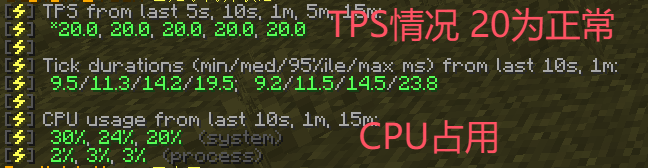

输入 `/ping` 指令检查服务器延迟，如果显示异常可能是您的网络与服务器连接不畅，在联系管理组反馈延迟异常之前，您可以尝试以下服务器地址

主线
```
233.ci
play.tianjimc.com
```
备用IP
```
play2.tianjimc.com
play3.tianjimc.com
play4.tianjimc.com
play5.tianjimc.com
bgp.tianjimc.com
```
怀旧服(以往服务器存档)
```
arc.tianjimc.com
```
怀旧服(以往服务器存档) - 备用IP
```
arc2.tianjimc.com
arc3.tianjimc.com
arc4.tianjimc.com
arc5.tianjimc.com
```

如果这些地址都无法解决您的网络延迟异常外，请联系管理组  

输入 `/tps` 指令检查当前所在的服务器性能状况，如果 TPS 偏低建议在服务器聊天吐槽或者联系管理组


